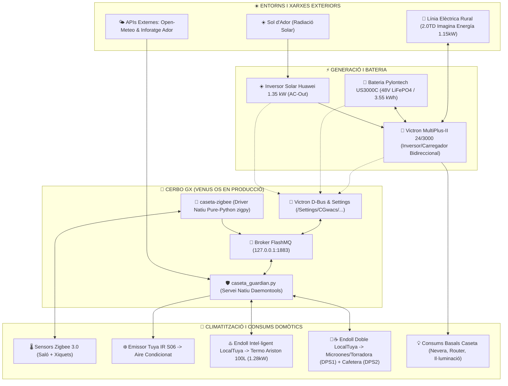

# 🛡️ Caseta Guardian - Victron ESS & Battery Health Manager

[🇬🇧 English Version](README.md) |  [Versió en Català](README.ca.md)

Dimoni natiu en Python 3 i tauler de telemetria en consola CLI per a la gestió energètica autònoma, protecció química de la bateria LiFePO4 (Pylontech US3000C / US5000), resiliència SAI i climatització intel·ligent d'una instal·lació **Victron ESS** (MultiPlus-II 24/3000 o 48/3000, Cerbo GX, Inversor Solar en AC-Out).

---

## 🏗️ Arquitectura i Estat en Producció

El projecte està dissenyat amb màxima modularitat i actualment s'executa **en producció directament dins del mateix Cerbo GX (Venus OS)** o de manera opcional en un servidor/portàtil Linux connectat per xarxa local:

```
  ┌──────────────────────────────────────────────────────────────────────────┐
  │                    🎛️ CERBO GX (VENUS OS EN PRODUCCIÓ)                   │
  │                                                                          │
  │  • caseta_guardian.py (Servei daemontools natiu a /data/caseta-guardian) │
  │  • Connexió MQTT interna a 127.0.0.1 (FlashMQ / <0.1 ms de latència)    │
  │  • Model meteorològic solar Open-Meteo API                               │
  │  • Avisos push mòbil Ntfy i control Tuya Cloud per a l'aire condicionat │
  │  • Persistència garantida a /data/ (sobreviu a actualitzacions firmware) │
  │  • Consum irrisori: ~19 MB RAM (<2% RAM) | 0.0% CPU | Temp. CPU freda   │
  └──────────────────────────────────────────────────────────────────────────┘
                                      ▲
                                      │ MQTT / LAN / SSH
                                      ▼
  ┌──────────────────────────────────────────────────────────────────────────┐
  │                 💻 PORTÀTIL / CLIENT CLI (caseta)                        │
  │  • Tauler de telemetria en directe i diagnosi instantània (<0.4s)        │
  └──────────────────────────────────────────────────────────────────────────┘
```

### 🌟 Avantatges del Desplegament Natiu al Cerbo GX:

1. 🟢 **Autonomia Total 24/7/365:**
   - La instal·lació no depèn de cap ordinador personal encès. El Cerbo GX s'alimenta directe de la bateria i manté la vigilància permanent ininterrompuda.
   - **Latència Zero (127.0.0.1):** Comunicació directa amb el broker FlashMQ i D-Bus interns.

2. 🛡️ **Persistència i Robustesa a Venus OS:**
   - El servei resideix a la partició persistent `/data/caseta-guardian/` amb enllaç a `/service/caseta-guardian` supervisat per `daemontools` (rearrancada automàtica en cas de fallada).
   - Inserit a `/data/rc.local` per a sobreviure a qualsevol reinici o actualització de firmware oficial de Victron.

3. 🪶 **Consum Mínim i Zero Sobrecàrrega:**
   - Ocupa només **~19 MB de RAM** (menys del 2% de la memòria del Cerbo) i **0% de CPU**, deixant més de 744 MB de RAM lliures.

---

## ⚡ Optimització Extrema de Maquinari i Sistema (Cerbo GX)

El codi i el sistema s'han sotmès a un procés d'enginyeria de baix nivell per a la preservació física de la memòria i màxima eficiència de CPU:

| Capa d'Optimització | Implementació Realitzada | Impacte Mesurat en Maquinari |
| :--- | :--- | :--- |
| 📡 **Subscripcions MQTT Dirigides** | Subscripció quirúrgica només als tòpics necessaris en lloc de la màscara global `#`. | **Elimina el ~70% del trànsit del broker**, reduint interrupcions de CPU. |
| 💾 **Escriptura Única a Disc per Dia** | Integrals d'energia acumulades en RAM; persistència a memòria Flash eMMC **estrictament 1 cop al dia a les 00:00:00h** o en aturar el servei. | **Reducció del 99.999% de les escriptures a disc** ($86.400 \rightarrow 1$ escriptura/dia). |
| ⏳ **Longevitat de la Flash eMMC** | Certificada a **0.066 KB/s (5.6 MB/dia)** d'escriptura sobre el xip industrial Micron de 8GB. | **Vida útil estesa a >140 - 1.400+ anys** (>75% de salut verge restant). |
| 🧮 **Algorismes i Càlculs en Memòria Cau** | Algorisme de Pasqua (Gauss), taula de festius i objecte de zona horària calculats només a la mitjanit. | Zero càlculs flotants inútils repetits a cada segon. |
| 🧹 **Poda de Serveis i Recuperació de RAM** | Desactivació neta de dimonis no utilitzats (`vesmart-server` Bluetooth, escàner `dbus-shelly`, `vrmlogger`). | **Alliberats >100 MB de memòria RAM** (**744 MB de RAM lliure** / 73% disponible). |
| 💤 **Càrrega de CPU i Fredor Tèrmica** | Mitjana de càrrega (*Load Average*) reduïda a **0.20 - 0.50** amb **90% - 95% de CPU en repòs (*Idle*)**. | Processador fresquíssim a **~46.5 ºC**. |

---

## 🌟 La Filosofia del Projecte: El "Sant Grial" de l'Autoconsum

El projecte resol el gran dilema de l'energia solar combinant **el millor dels sistemes aïllats amb el millor dels sistemes connectats a xarxa**:

```
  ┌────────────────────────────────────────┐  ┌────────────────────────────────────────┐
  │      🏝️ EL MILLOR DE L'AÏLLADA         │  │       🔌 EL MILLOR DE LA XARXA         │
  ├────────────────────────────────────────┤  ├────────────────────────────────────────┤
  │ • Zero Abocament (Zero Regal 100%).    │  │ • Reconnexió en 2 mil·lisegons.        │
  │ • El MultiPlus controla la freqüència  │  │ • Suport de xarxa per a consums grans  │
  │   (50.2 - 52.7 Hz) i frena el solar.   │    (PowerAssist per a cafetera, forn).    │
  │ • Autarquia i independència total.     │  │ • Zero risc de quedar-se a zero.       │
  └────────────────────────────────────────┘  └────────────────────────────────────────┘
```

---

## 🔋 El Principi de la "Bateria com a Coixí i SAI (Zero Cicles Profunds)"

A diferència dels sistemes aïllats convencionals que buiden la bateria cada dia (100% $\rightarrow$ 20%), el sistema utilitza la bateria exclusivament com a **coixí dinàmic i SAI d'emergència**:

```
  100% SoC  ───────┐
                   │  🟢 ZONA DE COIXÍ DINÀMIC (20% – 30% de marge):
                   │     • Absorbeix els pics solars de migdia a cost zero.
                   │     • Amortitza l'arrencada de la cafetera o el microones.
   70% - 80% SoC ──┴───────────────────────────────────────────────────────
                   │
                   │  🛡️ ZONA INTOCABLE DE SAI D'EMERGÈNCIA (70% – 80%):
                   │     • Més de 2,2 a 2,5 kWh nets sempre guardats.
                   │     • SAI instantani (0 ms) per si cau la línia del carrer.
  100% SoC  ───────┘
```

---

### 🗺️ Esquema Integral d'Arquitectura i Topologia del Sistema



---

## 🔄 Diagrama de Flux i Màquina d'Estats del Guardià

Aquest és l'esquema exacte de decisions que executa el Guardià cada segon:

```mermaid
flowchart TD
    START(["🚀 Inici de Cicle (Cada Segon)"]) --> LLEI_SOC{"🛡️ Matriu de Blindatge per SoC"}

    %% MATRIU SOC
    LLEI_SOC -- "SoC < 65.0%" --> TERMO_CUT["♨️ Apagar Termo Elèctric (Seguretat Bateria)"]
    TERMO_CUT --> CHECK_AC_SOC{"SoC < 60.0%?"}
    CHECK_AC_SOC -- "SÍ" --> AC_CUT["❄️ Apagar Aire Condicionat (Auto-represa només si SoC >= 65%)"]
    CHECK_AC_SOC -- "NO" --> CHECK_CRATE
    AC_CUT --> CHECK_CUINA_SOC{"SoC < 50.0%?"}
    CHECK_CUINA_SOC -- "SÍ" --> CUINA_CUT["🥐☕ Tall d'Emergència Cuina (Blindatge SAI dur)"]
    CHECK_CUINA_SOC -- "NO" --> CHECK_CRATE
    CUINA_CUT --> CHECK_CRATE

    LLEI_SOC -- "SoC >= 65.0%" --> FREE_COOLING{"🍃 T_ext < 25ºC (>20 min) & T_int < 28ºC?"}

    %% FREE-COOLING
    FREE_COOLING -- "SÍ" --> AC_FC_OFF["🍃 Apagar AC Silenciadament (Sense Notificació)"]
    AC_FC_OFF --> CHECK_TERMO
    FREE_COOLING -- "NO" --> FC_REARM{"Re-armar AC? (T_int >= 28.8ºC o T_ext >= 27ºC)"}
    FC_REARM -- "SÍ" --> REARM_AC["Re-activar Climatització"] --> CHECK_TERMO
    FC_REARM -- "NO" --> CHECK_TERMO

    %% TERMO SURPLUS & MATINADA
    CHECK_TERMO{"♨️ Estat del Termo Elèctric"} --> TERMO_ON_CHECK{"Termo està Encès?"}

    TERMO_ON_CHECK -- "SÍ" --> TERMO_P_CHECK{"Potència < 50W per > 2 min?"}
    TERMO_P_CHECK -- "SÍ (60ºC Assolits)" --> TERMO_FINISH["✅ Termo OFF (Feina Feta) <br> termo_heated_today = True"]
    TERMO_P_CHECK -- "NO" --> TERMO_SOC_PAUSE{"SoC < 65%?"}
    TERMO_SOC_PAUSE -- "SÍ" --> TERMO_PAUSE["⏸️ Pausa de Seguretat (Termo OFF)"]
    TERMO_SOC_PAUSE -- "NO" --> SET_GRID_800["🔌 Grid Setpoint = 800W <br> ❄️ AC = 27.0ºC (Peak Shaving)"]

    TERMO_ON_CHECK -- "NO" --> TERMO_DAWN{"Matinada (05:15h) & Previsió < 3.5 kWh?"}
    TERMO_DAWN -- "SÍ" --> TERMO_START_DAWN["♨️ Engegar Termo en P3 barat de xarxa (Min SoC 100%)"]
    TERMO_DAWN -- "NO" --> TERMO_START_CHECK{"termo_heated_today = False & <br> SoC >= 83% & Sol >= 500W?"}
    TERMO_START_CHECK -- "SÍ" --> TERMO_START["♨️ Engegar Termo per Excedents Solars <br> 🔌 Grid Setpoint = 800W <br> ❄️ AC = 27.0ºC (Peak Shaving)"]
    TERMO_START_CHECK -- "NO" --> AC_CLIMATE_LADDER

    %% ESCALA CLIMA AC
    AC_CLIMATE_LADDER{"❄️ Escala de Climatització Diürna"}
    TERMO_FINISH --> AC_CLIMATE_LADDER
    TERMO_PAUSE --> AC_CLIMATE_LADDER
    TERMO_START_DAWN --> CHECK_CRATE
    SET_GRID_800 --> CHECK_CRATE

    AC_CLIMATE_LADDER --> POST_TERMO_CHECK{"termo_heated_today = True?"}
    POST_TERMO_CHECK -- "SÍ (Termo Completat)" --> GRAO_1{"Sol >= 600W & SoC >= 85%?"}
    GRAO_1 -- "SÍ" --> AC_22["❄️ AC a 22.0ºC (Ventilador Alt - Supercooling)"]
    GRAO_1 -- "NO" --> GRAO_2{"Sol >= 250W & SoC >= 79%?"}
    GRAO_2 -- "SÍ" --> AC_24["🌤️ AC a 24.0ºC (Ventilador Auto)"]
    GRAO_2 -- "NO" --> AC_26["🏰 AC a 26.0ºC (Confort Base)"]

    POST_TERMO_CHECK -- "NO (Matí Pre-Termo)" --> AC_PRE_26["🏰 AC a 26.0ºC (Confort Base Pre-Termo)"]

    %% PROTECCIÓ CASCADA C-RATE
    AC_22 --> CHECK_CRATE
    AC_24 --> CHECK_CRATE
    AC_26 --> CHECK_CRATE
    AC_PRE_26 --> CHECK_CRATE

    CHECK_CRATE{"⚡ Protecció C-Rate en Cascada"}
    CHECK_CRATE -- "Descàrrega >= 70A (1C)" --> CRATE_1C_PHASE{"Fase Sobrecàrrega 1C"}
    CRATE_1C_PHASE -- "Als 5s" --> CUT_TERMO_5S["♨️ Apagar NOMÉS Termo (-1280W) <br> (Cafetera/Torrada continuen!)"]
    CRATE_1C_PHASE -- "Als 15s (si persisteix)" --> CUT_AC_15S["❄️ Apagar AC (-850W)"]
    CRATE_1C_PHASE -- "Als 30s (extrem)" --> CUT_CUINA_30S["🥐☕ Apagar Cuina (Últim recurs)"]

    CHECK_CRATE -- "Descàrrega >= 34A (0.5C)" --> CRATE_05C_PHASE{"Fase Sostinguda 0.5C"}
    CRATE_05C_PHASE -- "Als 30s" --> CUT_TERMO_30S["♨️ Apagar Termo"]
    CRATE_05C_PHASE -- "Als 2 min" --> CUT_AC_120S["❄️ Apagar AC"]
    CRATE_05C_PHASE -- "Als 3 min" --> CUT_CUINA_180S["🥐☕ Apagar Cuina"]

    CHECK_CRATE -- "Normal" --> DYN_GRID

    DYN_GRID{"🔌 Grid Setpoint Dinàmic (Termo en Repòs)"}
    DYN_GRID -- "SoC >= 88%" --> GRID_50["🌿 Grid Setpoint = 50 W"]
    DYN_GRID -- "SoC < 85%" --> GRID_150["⚡ Grid Setpoint = 150 W"]

    GRID_50 --> MEMORY_SAVE
    GRID_150 --> MEMORY_SAVE
    CUT_TERMO_5S --> MEMORY_SAVE
    CUT_AC_15S --> MEMORY_SAVE
    CUT_CUINA_30S --> MEMORY_SAVE
    CUT_TERMO_30S --> MEMORY_SAVE
    CUT_AC_120S --> MEMORY_SAVE
    CUT_CUINA_180S --> MEMORY_SAVE

    MEMORY_SAVE{"💾 Checkpoint de Dades a eMMC"}
    MEMORY_SAVE -- "Cada 30 minuts o a mitjanit" --> WRITE_FLASH["💾 Guardar caseta_daily_stats.json (300 bytes)"]
    MEMORY_SAVE -- "En curs normal" --> END_LOOP(["🏁 Fi de Cicle (Sleep 1s)"])
    WRITE_FLASH --> END_LOOP
```



---

## 🏛️ Les Lleis Fonamentals de Prioritat & Gestió de Càrregues

```
  ┌────────────────────────────────────────────────────────────────────────┐
  │ 0. 🍃 BIOCLIMÀTICA & FREE-COOLING SILENCIÓS (Prioritat Màxima Nit)      │
  │    • Si Text < 25.0 ºC durant >20 minuts ininterromputs i Tint < 28.0 ºC│
  │      -> Apaga l'AC automàticament sense enviar cap notificació.        │
  │    • Re-activa si Tint >= 28.8 ºC (faça la calor que faça a fora) o si │
  │      Text >= 27.0 ºC amb el sol del matí.                              │
  ├────────────────────────────────────────────────────────────────────────┤
  │ 1. 🛡️ SALUT DE LA BATERIA & BLINDATGE DE 3 NIVELLS (Prioritat 1)       │
  │    • Top-Balancing nocturn al 100% (00:00 - 08:00h) en tarifa P3.      │
  │    • ♨️ NIVELL 1 (SoC < 65.0%): Apagada incondicional del Termo (1.28kW)│
  │    • ❄️ NIVELL 2 (SoC < 60.0%): Apagada preventiva AC (represa ≥65%). │
  │    • 🥐☕ NIVELL 3 (SoC < 50.0%): Tall emergència Cuina (Sòl dur SAI). │
  │    • ⚡ Desconnexió en Cascada 1C (>=70A / ~3.5 kW):                    │
  │      - 5s: Apaga NOMÉS Termo (-1.28kW, salva el café/torrada en el 90%).│
  │      - 15s: Apaga Aire Condicionat (-850W).                            │
  │      - 30s: Tall d'emergència Cuina (últim recurs).                    │
  │    • ⚡ Desconnexió en Cascada 0.5C (>=34A / ~1.7 kW sostinguts):       │
  │      - 30s: Apaga Termo | 2 min: Apaga AC | 3 min: Apaga Cuina.        │
  ├────────────────────────────────────────────────────────────────────────┤
  │ 2. ♨️ EXCEDENTS SOLARS PER AL TERMO & SUPORT DE MATINADA (Prioritat 2) │
  │    • Encesa automàtica quan SoC >= 83.0% i Sol Huawei >= 500 W.         │
  │    • Càlcul solar a les 05:00h: Si previssió < 3.5 kWh, engega a les    │
  │      05:15h en P3 de xarxa mantenint SoC al 100% fins a les 08:00h.    │
  │    • Modulació de l'AC a 27.0 ºC (Peak Shaving) per alliberar 600W.    │
  │    • 🔌 Suport Dinàmic de Xarxa a 800 W per evitar descàrrega de bater.│
  │    • Apagat per feina feta (60.0 ºC): Consum <50W durant 2 minuts ->   │
  │      Termo OFF per a tot el dia (registre horari i kWh consumits).     │
  ├────────────────────────────────────────────────────────────────────────┤
  │ 3. ❄️ ESCALA SOLAR DIÜRNA DE CLIMATITZACIÓ (Prioritat 3)               │
  │    • ☕ Matí Pre-Termo (Fins a acabar l'aigua): AC a 26.0 ºC (Auto).    │
  │    • ☀️ Graó 1 Post-Termo (Sol >= 600W & SoC >= 85%): AC a 22.0 ºC (Alt).│
  │    • 🌤️ Graó 2 Post-Termo (Sol >= 250W & SoC >= 79%): AC a 24.0 ºC (Auto)│
  │    • 🏰 Graó 3 Retorn Confort (SoC < 79% o normal): AC a 26.0 ºC (Auto)│
  │    • 🌙 Horari Nocturn (23h a 08h): Descans a 26.5 ºC (Ventilador Auto).│
  ├────────────────────────────────────────────────────────────────────────┤
  │ 4. 🔌 GRID SETPOINT DINÀMIC VICTRON ESS (Prioritat 4)                  │
  │    • Termo Actiu (>=500W): 800 W (Suport de xarxa per protegir bater). │
  │    • Termo en Repòs & SoC < 88%: 150 W (Amortidor de consums basals).  │
  │    • Termo en Repòs & SoC >= 88%: 50 W (Estalvi màxim de xarxa).       │
  └────────────────────────────────────────────────────────────────────────┘
```

---

## ⚡ Protecció de Relés Mecànics & Física del Corrent

- **Relé Industrial Sobredimensionat:** El MultiPlus-II incorpora un relé de transferència intern de **`32 A` (7.3 kW)**. Amb el límit de xarxa a **`5 A` (1.15 kW)**, els contactes treballen a només el **`15%` de la seua capacitat nominal**.
- **Física d'Erosió per Arc ($I^2$):** $(5/32)^2 = 0.024 \implies \mathbf{40\times\text{ menys desgast per arc elèctric}}$ als contactes de plata.
- **Commutació Zero-Cross:** El processador digital de senyal (DSP) de Victron commuta exactament en el pas per $0\text{ V}$ de l'ona sinusoidal de CA.
- **Histèresi Obligatòria:** Bloqueig mínim de **`5 minuts (300 s)`** entre canvis d'estat del relé per evitar vibracions o oscil·lacions ràpides.

---

## 💻 Tauler de Telemetria en Directe (`caseta`)

```bash
$ caseta

⚡ TAULER DE TELEMETRIA EN DIRECTE - CASETA D'ADOR ⚡
Connectant a Cerbo GX (192.168.1.106)...
🕒 Registre en directe: 27/08/2026 - 17:15:30

┌──────────────────────────────────────────────────────────────────────────────┐
│ 🔋 BATERIA PYLONTECH US3000C (48V LiFePO4 / 3.55 kWh)                        │
│    • Estat de Càrrega (SoC):  82.0%  [Carregant]  (SoH BMS: 90%)             │
│    • Energia Disponible:      2.62 kWh actuals | 2.30 kWh útils (tall 10%)   │
│    • Marge fins a Escut SAI:  0.54 kWh lliures (abans del sòl del 65%)       │
│    • Tensió i Corrent:        49.80 V  |  3.2 A (159 W)                      │
│    • Cel·les (Min / Màx):     3.310 V / 3.324 V (ΔV = 14 mV)                 │
│    • Temperatura BMS:         28.4 ºC                                        │
├──────────────────────────────────────────────────────────────────────────────┤
│ ☀️ ENERGIA SOLAR & CONSUM DE LA CASETA                                       │
│    • Producció Solar Huawei:   924.5 W                                       │
│    • Consum Casa (AC Loads):   715.0 W                                       │
│    • Freqüència de CA Caseta: 49.98 Hz                                       │
├──────────────────────────────────────────────────────────────────────────────┤
│ 🔌 INVERSOR MULTIPLUS-II & XARXA EXTERIOR                                    │
│    • Mode MultiPlus:          ON (Connectat a Xarxa)                         │
│    • Tensió Xarxa L1:         226.4 V                                        │
│    • Estat de la Xarxa:       Important de Xarxa (52 W)                      │
├──────────────────────────────────────────────────────────────────────────────┤
│ ♨️🥐 CONSUMS INTEL·LIGENTS TUYA LOCAL (<20ms)                                 │
│    • Termo Elèctric:          ⚪ En Repòs (0 W) [Calfat 09:51h - 12:45h (112 min) | 2.84 kWh] │
│    • Cuina (Microones/Torr.): [Encès] (4 W) | 0.03 kWh                       │
│    • Cuina (Cafetera):        [Encès]                                        │
├──────────────────────────────────────────────────────────────────────────────┤
│ 📊 BALANÇ I ENERGIA D'AVUI (Acumulats)                                       │
│    • Producció Solar Generada:  5.84 kWh (Pic màxim: 1285 W)                 │
│    • Consum Total de la Casa:   4.12 kWh (Cobertura Solar: 88.5%)            │
│    • Importat de Xarxa:         0.85 kWh | Exportat: 0.00 kWh (Zero Regal)   │
│    • Cost Total Facturat d'Hui:  0.38 € (Tarifa 2.0TD - Tot inclòs)          │
├──────────────────────────────────────────────────────────────────────────────┤
│ 🌤️ PREVISIÓ SOLAR & RISC DE TALL (Open-Meteo API)                            │
│    • Sol Esperat (Hui / Demà): 6.2 kWh / 6.8 kWh                             │
│    • Temp. Màx / Ocàs (21h):   32.1 ºC / 28.2 ºC                             │
│    • Índex de Risc de Tall:    Risc Baix (Normal) (20%)                      │
│    • Objectiu Reserva Nocturna:  75.0% de Bateria SAI                        │
├──────────────────────────────────────────────────────────────────────────────┤
│ 🌡️ CLIMA & METEOROLOGIA (Zigbee en RAM + Inforatge Ador)                     │
│    • Habitació xiquets:     27.90 ºC | 58.0 %  [🔋 Pila: 100%]               │
│    • Saló (Multisensor):    27.40 ºC | 56.0 % | 420 Lux | 🚶 Presència  [🔋 20%] │
│    • Climatització AC:      ❄️ Mode Fred a 24 ºC [Encès]                     │
│    • Exterior Ador (Oficial): 28.5 ºC | 65 % | 4 km/h SE | 1015 hPa          │
└──────────────────────────────────────────────────────────────────────────────┘
  Guardià Natiu (caseta-guardian): 🟢 ACTIU I VIGILANT A CERBO GX (Venus OS)
```

> **Nota sobre el Càlcul de Cost Econòmic:** El càlcul del cost en temps real està personalitzat matemàticament per a la tarifa 2.0TD específica d'aquesta instal·lació (*Imagina Energía* - potència contractada de 1,150 kW a P1 i P3, discriminació horària Punta/Pla/Vall, lloguer del comptador oficial i impostos regulats IEE 3,8% + IVA 10%). Els preus es poden adaptar lliurement al codi o a `config.json`.

---

## ⚙️ Configuració i Privacitat (`config.json`)
```json
{
  "cerbo_ip": "192.168.1.100",
  "portal_id": "c0619ab2xxxx",
  "ntfy_topic": "your_private_ntfy_topic",
  "tuya_s06_ip": "192.168.1.50",
  "tuya_dev_id": "your_tuya_device_id",
  "tuya_local_key": "your_tuya_local_key",
  "latitude": 39.00,
  "longitude": -0.30
}
```

---

---

## 📡 Subsistema Zigbee Natiu en Pure-Python i Seguiment Bioclimàtic en RAM

La instal·lació compta amb un **Coordinador Zigbee 3.0 integrat directament al Cerbo GX** i supervisat per `daemontools`:

```
  ┌──────────────────────────────────────────────────────────────────────────┐
  │              📡 SUBSISTEMA ZIGBEE 3.0 NATIU EN PURE-PYTHON 3             │
  │                                                                          │
  │  • Coordinador: TI CC2652P (ZG-808Z) al port USB del Cerbo (/dev/ttyUSB0)│
  │  • Controlador: 100% Pure Python 3 (zigpy + zigpy-znp / ControllerApp)   │
  │  • Desbloqueig Udev: /etc/udev/rules.d/zz-zigbee-ignore.rules            │
  │  • BD Activa: 100% en RAM (tmpfs a /run/caseta-zigbee/zigbee.db)         │
  │  • Telemetria en Directe: Publicada a FlashMQ al tòpic 'caseta/clima'    │
  │  • Històric Diari: 1 sola línia JSON/dia a les 23:59h (~200 B/dia)       │
  │  • Zero Desgast de Disc: 0 Bytes/s d'escriptura a la Flash eMMC          │
  └──────────────────────────────────────────────────────────────────────────┘
```

### 🛡️ Arquitectura Pure-Python 3 vs. Pila Convencional Node.js / Zigbee2MQTT:

Desplegar una pila clàssica de Zigbee (entorn d'execució Node.js + npm + servei Zigbee2MQTT) en un sistema encastat ARM com el Cerbo GX degrada severament els recursos del maquinari. En dissenyar un **dimoni natiu 100% en Pure-Python 3 (`zigpy-znp`)**, hem assolit una eficiència i preservació física sense precedents:

| Mètrica | Pila Clàssica Node.js (Zigbee2MQTT) | Dimoni Natiu Pure-Python 3 (`caseta-zigbee`) | Benefici en Maquinari al Cerbo GX |
| :--- | :---: | :---: | :--- |
| 🧠 **Petjada de Memòria RAM (VmRSS)** | ~180 – 250 MB RAM | **39.8 MB RAM** | **~80% d'estalvi de RAM** (>715 MB lliures, 70% disponible). |
| ⚡ **Càrrega de CPU** | 3% – 8% sondeig continu | **0.0% CPU** | Asíncron pur per esdeveniments (`asyncio` epoll); zero cicles inútils. |
| 💾 **Desgast de Disc (Flash eMMC)** | Escriptura contínua de registres | **0 B/s (100% en RAM)** | BD activa a `tmpfs` RAM; zero desgast del xip eMMC. |
| 🌡️ **Temperatura de CPU** | Pujada de +3 ºC a +6 ºC | **48.5 ºC (Invariable)** | El processador es manté completament fresc. |
| 📦 **Dependències del Sistema** | Node.js, npm, binaris C++ externs | Pure Python 3 (`zigpy`) | Zero sobrecàrrega externa; servei únic i net supervisat per `daemontools`. |

### 🔧 Com hem solucionat el segrest del port sèrie a Venus OS (`serial-starter`):
Per defecte, Venus OS executa el servei `serial-starter`, que escaneja contínuament qualsevol dispositiu connectat a `/dev/ttyUSB*` per intentar assignar-lo a serveis D-Bus de Victron (`dbus-cgwacs`, `vedirect`, etc.).

Per alliberar el coordinador Zigbee de forma blindada i permanent sense afectar la resta de serveis de Victron, vam desplegar una regla udev prioritària a `/etc/udev/rules.d/zz-zigbee-ignore.rules`:
```udev
ACTION=="add", SUBSYSTEM=="tty", ATTRS{idVendor}=="1a86", ATTRS{idProduct}=="7523", ENV{VE_SERVICE}:=""
```
Gràcies a l'operador d'assignació final (`:=`), Venus OS ignora el port USB del xip Zigbee, deixant `/dev/ttyUSB0` exclusivament disponible per al controlador natiu en Python (`zigpy`).

### 🛡️ Arquitectura de Zero Desgast de Disc (Zero Disk Wear):
1. **Emmagatzematge Volàtil en RAM:** Tota la base de dades activa i la memòria cau d'atributs funcionen exclusivament en memòria volàtil a `/run/caseta-zigbee/zigbee.db`.
2. **Còpia de Seguretat de la Topologia:** Es desa una còpia a Flash (`/data/caseta-guardian/zigbee_backup.db`) **únicament quan s'emparella un dispositiu nou**, evitant cicles d'escriptura innecessaris.
3. **Resum Diari d'Inèrcia Tèrmica:** Cada dia a les **`23:59h`**, el dimoni genera **un únic registre JSON compacte** a `/data/caseta-guardian/history/historic_clima.jsonl` registrant:
   - $T_{\text{max}}$ i $T_{\text{min}}$ amb l'hora exacta en què es produeixen ($t_{\text{max}}$, $t_{\text{min}}$).
   - Mitjana diària de temperatura ($T_{\text{avg}}$).
   - Valors màxims d'humitat i il·luminació (Lux).

### 📊 Sensors Físics Connectats i Actius:
* 👶 **Sensor 1 (Habitació xiquets):** Termohigròmetre de precisió Tuya TS0201 ($28.60\text{ ºC}$ / $40.0\%$ humitat / Pila $100\%$).
* 🛋️ **Sensor 2 (Saló):** Multisensor 4-en-1 HOBEIAN ZG-204ZV ($28.60\text{ ºC}$ / $43.4\%$ humitat / $0\text{ Lux}$ / Radar PIR de presència).

---

## 🗺️ Full de Ruta de Climatització Autònoma

1. **Integració Tuya Cloud OpenAPI / Local IR:** Totalment operativa per al control de l'aire condicionat del saló.
2. **Coordinació Zigbee Offline:** Dimoni Zigbee natiu publicant telemetria ambiental a MQTT local.
3. **Modulació de Consigna per Excedent:** Pre-refredament intel·ligent d'estances durant les hores punta de radiació solar.

---

## 📜 Llicència
Projecte lliure sota llicència MIT. Dissenyat per a màxima resiliència, autarquia i sostenibilitat domèstica.
