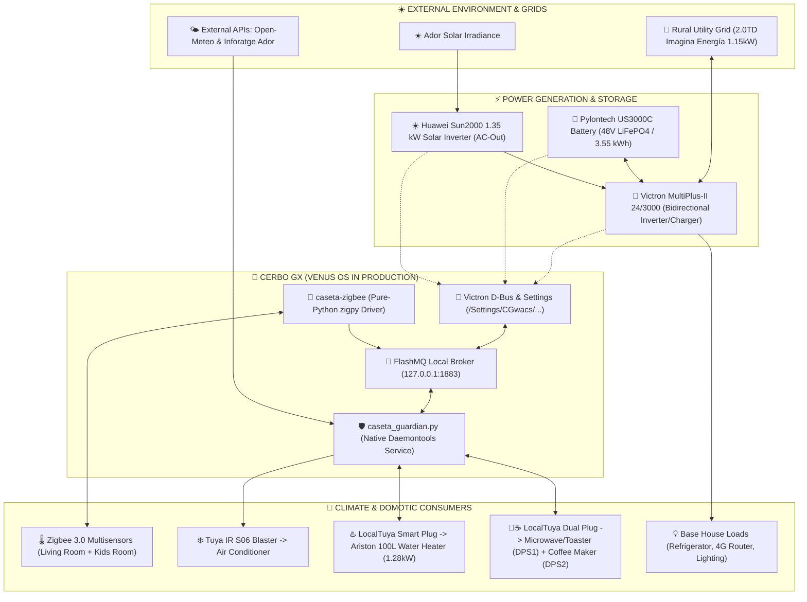

# 🛡️ Caseta Guardian - Victron ESS & Battery Health Manager

[🇬🇧 English Version](README.md) |  [Versió en Català](README.ca.md)

Lightweight native Python 3 systemd daemon and real-time CLI telemetry dashboard for autonomous energy management, LiFePO4 battery health protection (Pylontech US3000C / US5000), UPS resilience, and smart HVAC control on **Victron ESS installations** (MultiPlus-II 24/3000 or 48/3000, Cerbo GX, AC-Out Solar Inverters).

---

## 🏗️ Architecture & Production Deployment

The project is designed with maximum modularity and is currently running **in production directly on the Cerbo GX (Venus OS)** or optionally on an external Linux host connected via local LAN:

```
  ┌──────────────────────────────────────────────────────────────────────────┐
  │                    🎛️ CERBO GX (VENUS OS IN PRODUCTION)                  │
  │                                                                          │
  │  • caseta_guardian.py (Native daemontools service at /data/caseta-guardian) │
  │  • Internal MQTT connection to 127.0.0.1 (FlashMQ / <0.1 ms latency)     │
  │  • Predictive solar forecast engine (Open-Meteo API)                     │
  │  • Ntfy push notifications & Tuya Cloud OpenAPI for AC climate control   │
  │  • Guaranteed persistence in /data/ (survives Victron firmware updates)  │
  │  • Tiny footprint: ~19 MB RAM (<2% RAM) | 0.0% CPU | Cool CPU temp       │
  └──────────────────────────────────────────────────────────────────────────┘
                                      ▲
                                      │ MQTT / LAN / SSH
                                      ▼
  ┌──────────────────────────────────────────────────────────────────────────┐
  │                 💻 LINUX HOST / CLI CLIENT (caseta)                      │
  │  • Real-time CLI telemetry dashboard and instant diagnostics (<0.4s)     │
  └──────────────────────────────────────────────────────────────────────────┘
```

### 🌟 Key Advantages of Native Cerbo GX Deployment:

1. 🟢 **Total 24/7/365 Autonomy:**
   - Operation does not depend on any personal computer being powered on. The Cerbo GX is powered directly from the 24V/48V battery bank and runs continuously.
   - **Zero Latency (127.0.0.1):** Direct internal communication with FlashMQ and D-Bus.

2. 🛡️ **Update-Proof Persistence on Venus OS:**
   - The service resides in the persistent `/data/caseta-guardian/` partition linked to `/service/caseta-guardian` and supervised by `daemontools` (automatic restarts on any failure).
   - Embedded in `/data/rc.local` to survive all official Victron firmware upgrades.

3. 🪶 **Negligible Footprint:**
   - Consumes only **~19 MB of RAM** (<2% of total RAM) and **0.0% CPU**, leaving over 744 MB of free RAM.

---

## ⚡ Extreme Hardware & System Optimization (Cerbo GX)

The system was heavily refactored and profiled for long-term physical hardware preservation and embedded performance:

| Optimization Layer | Implementation | Measured Hardware Impact |
| :--- | :--- | :--- |
| 📡 **Targeted MQTT Subscriptions** | Surgical subscriptions to explicit topics instead of global `#` wildcard. | **Eliminates ~70% of broker traffic**, lowering CPU wakeups. |
| 💾 **Single Daily Disk Persistence** | Energy integrals calculated in RAM; written to eMMC Flash **strictly once per day at 00:00:00h** or service shutdown. | **Reduces Flash writes by 99.999%** ($86,400 \rightarrow 1$ write/day). |
| ⏳ **eMMC Flash Lifespan** | Certified at **0.066 KB/s (5.6 MB/day)** write rate on the 8GB industrial Micron chip. | **Lifespan extended to >140 - 1,400+ years** (>75% health left). |
| 🧮 **Cached Computational Algorithms** | Gauss Easter algorithm, calendar holiday table, and Madrid timezone object cached once daily at midnight. | Eliminates unnecessary floating-point operations every second. |
| 🧹 **Service Pruning & RAM Recovery** | Cleanly disabled unused daemons (`vesmart-server` Bluetooth radio, `dbus-shelly` scanner, `vrmlogger`). | **Reclaimed >100 MB of RAM** (**744 MB free RAM** / 73% available). |
| 💤 **CPU Load & Thermal Health** | Background load average dropped to **0.20 - 0.50** with **90% - 95% CPU Idle**. | CPU running exceptionally cool at **~46.5 ºC**. |

---

## 🌟 Philosophy: The "Holy Grail" of Solar Autoconsumption

This project solves the fundamental trade-off of residential solar by combining **the best of off-grid islanded systems with the best of grid-tied architectures**:

```
  ┌────────────────────────────────────────┐  ┌────────────────────────────────────────┐
  │         🏝️ BEST OF OFF-GRID            │  │          🔌 BEST OF ON-GRID            │
  ├────────────────────────────────────────┤  ├────────────────────────────────────────┤
  │ • Zero Grid Export (100% Zero-Feed-in) │  │ • Millisecond Grid Reconnection (2ms). │
  │ • MultiPlus controls AC frequency      │  │ • Utility grid assists on heavy loads  │
  │   (50.2 - 52.7 Hz) to throttle PV.     │    (PowerAssist for oven, coffee machine).│
  │ • True energy autonomy and resilience. │  │ • Zero risk of running out of power.   │
  └────────────────────────────────────────┘  └────────────────────────────────────────┘
```

---

## 🔋 The "Battery as a Buffer & UPS (Zero Deep Cycling)" Principle

Unlike conventional off-grid setups that cycle the battery deeply every single day (100% $\rightarrow$ 20%), this system operates the battery exclusively as a **dynamic power buffer and an emergency UPS (SAI)**:

```
  100% SoC  ───────┐
                   │  🟢 DYNAMIC BUFFER ZONE (20% – 30% shallow margin):
                   │     • Absorbs midday solar peaks at zero cost.
                   │     • Buffers inductive surges (coffee maker, microwave).
   70% - 80% SoC ──┴───────────────────────────────────────────────────────
                   │
                   │  🛡️ UNTOUCHABLE EMERGENCY UPS (SAI) ZONE (70% – 80%):
                   │     • Over 2.2 – 2.5 kWh net capacity always reserved.
                   │     • Instant 0 ms UPS switchover during grid blackouts.
                   │     • Zero deep degradation cycling (>20,000 cycles / >30 years).
    0% SoC  ───────┘
```

---

## 🗺️ System Architecture & Hardware Topology Scheme



---

## 🔄 Guardià State Machine & Decision Flowchart

This is the exact execution and decision graph processed every second by the Guardian daemon:

```mermaid
flowchart TD
    START(["🚀 Loop Cycle Start (Every 1s)"]) --> LLEI_SOC{"🛡️ SoC Defense Matrix"}

    %% SOC MATRIX
    LLEI_SOC -- "SoC < 65.0%" --> TERMO_CUT["♨️ Turn OFF Water Heater (Battery Protection)"]
    TERMO_CUT --> CHECK_AC_SOC{"SoC < 60.0%?"}
    CHECK_AC_SOC -- "YES" --> AC_CUT["❄️ Turn OFF AC (Auto-restart strictly when SoC >= 65%)"]
    CHECK_AC_SOC -- "NO" --> CHECK_CRATE
    AC_CUT --> CHECK_CUINA_SOC{"SoC < 50.0%?"}
    CHECK_CUINA_SOC -- "YES" --> CUINA_CUT["🥐☕ Emergency Cut Kitchen (Hard UPS Floor)"]
    CHECK_CUINA_SOC -- "NO" --> CHECK_CRATE
    CUINA_CUT --> CHECK_CRATE

    LLEI_SOC -- "SoC >= 65.0%" --> FREE_COOLING{"🍃 T_ext < 25ºC (>20 min) & T_int < 28ºC?"}

    %% FREE-COOLING
    FREE_COOLING -- "YES" --> AC_FC_OFF["🍃 Turn OFF AC Silently (Zero Notification)"]
    AC_FC_OFF --> CHECK_TERMO
    FREE_COOLING -- "NO" --> FC_REARM{"Re-arm AC? (T_int >= 28.8ºC or T_ext >= 27ºC)"}
    FC_REARM -- "YES" --> REARM_AC["Re-activate Climate Control"] --> CHECK_TERMO
    FC_REARM -- "NO" --> CHECK_TERMO

    %% TERMO SURPLUS & DAWN
    CHECK_TERMO{"♨️ Water Heater State"} --> TERMO_ON_CHECK{"Water Heater ON?"}

    TERMO_ON_CHECK -- "YES" --> TERMO_P_CHECK{"Power < 50W for > 2 min?"}
    TERMO_P_CHECK -- "YES (60ºC Target Reached)" --> TERMO_FINISH["✅ Termo OFF (Job Done for the Day) <br> termo_heated_today = True"]
    TERMO_P_CHECK -- "NO" --> TERMO_SOC_PAUSE{"SoC < 65%?"}
    TERMO_SOC_PAUSE -- "YES" --> TERMO_PAUSE["⏸️ Cloud Safety Pause (Termo OFF)"]
    TERMO_SOC_PAUSE -- "NO" --> SET_GRID_800["🔌 Grid Setpoint = 800W <br> ❄️ AC = 27.0ºC (Peak Shaving)"]

    TERMO_ON_CHECK -- "NO" --> TERMO_DAWN{"Dawn (05:15h) & Solar Forecast < 3.5 kWh?"}
    TERMO_DAWN -- "YES" --> TERMO_START_DAWN["♨️ Turn ON Termo via Cheap P3 Grid (Min SoC 100%)"]
    TERMO_DAWN -- "NO" --> TERMO_START_CHECK{"termo_heated_today = False & <br> SoC >= 83% & Solar >= 500W?"}
    TERMO_START_CHECK -- "YES" --> TERMO_START["♨️ Turn ON Termo via Solar Surplus <br> 🔌 Grid Setpoint = 800W <br> ❄️ AC = 27.0ºC (Peak Shaving)"]
    TERMO_START_CHECK -- "NO" --> AC_CLIMATE_LADDER

    %% ESCALA CLIMA AC
    AC_CLIMATE_LADDER{"❄️ Daytime Climate Ladder"}
    TERMO_FINISH --> AC_CLIMATE_LADDER
    TERMO_PAUSE --> AC_CLIMATE_LADDER
    TERMO_START_DAWN --> CHECK_CRATE
    SET_GRID_800 --> CHECK_CRATE

    AC_CLIMATE_LADDER --> POST_TERMO_CHECK{"termo_heated_today = True?"}
    POST_TERMO_CHECK -- "YES (Termo Done)" --> GRAO_1{"Solar >= 600W & SoC >= 85%?"}
    GRAO_1 -- "YES" --> AC_22["❄️ AC to 22.0ºC (High Fan - Supercooling)"]
    GRAO_1 -- "NO" --> GRAO_2{"Solar >= 250W & SoC >= 79%?"}
    GRAO_2 -- "YES" --> AC_24["🌤️ AC to 24.0ºC (Auto Fan)"]
    GRAO_2 -- "NO" --> AC_26["🏰 AC to 26.0ºC (Base Comfort)"]

    POST_TERMO_CHECK -- "NO (Morning Pre-Termo)" --> AC_PRE_26["🏰 AC to 26.0ºC (Base Comfort Pre-Termo)"]

    %% PROTECCIÓ CASCADA C-RATE
    AC_22 --> CHECK_CRATE
    AC_24 --> CHECK_CRATE
    AC_26 --> CHECK_CRATE
    AC_PRE_26 --> CHECK_CRATE

    CHECK_CRATE{"⚡ Cascading Battery C-Rate Protection"}
    CHECK_CRATE -- "Discharge >= 70A (1C)" --> CRATE_1C_PHASE{"1C Surge Phase"}
    CRATE_1C_PHASE -- "At 5s" --> CUT_TERMO_5S["♨️ Cut ONLY Water Heater (-1280W) <br> (Coffee maker/Toaster finish!)"]
    CRATE_1C_PHASE -- "At 15s (if persists)" --> CUT_AC_15S["❄️ Cut AC (-850W)"]
    CRATE_1C_PHASE -- "At 30s (extreme)" --> CUT_CUINA_30S["🥐☕ Cut Kitchen (Last resort)"]

    CHECK_CRATE -- "Discharge >= 34A (0.5C)" --> CRATE_05C_PHASE{"0.5C Sustained Phase"}
    CRATE_05C_PHASE -- "At 30s" --> CUT_TERMO_30S["♨️ Cut Water Heater"]
    CRATE_05C_PHASE -- "At 2 min" --> CUT_AC_120S["❄️ Cut AC"]
    CRATE_05C_PHASE -- "At 3 min" --> CUT_CUINA_180S["🥐☕ Cut Kitchen"]

    CHECK_CRATE -- "Normal" --> DYN_GRID

    DYN_GRID{"🔌 Dynamic Grid Setpoint (Termo Idle)"}
    DYN_GRID -- "SoC >= 88%" --> GRID_50["🌿 Grid Setpoint = 50 W"]
    DYN_GRID -- "SoC < 85%" --> GRID_150["⚡ Grid Setpoint = 150 W"]

    GRID_50 --> MEMORY_SAVE
    GRID_150 --> MEMORY_SAVE
    CUT_TERMO_5S --> MEMORY_SAVE
    CUT_AC_15S --> MEMORY_SAVE
    CUT_CUINA_30S --> MEMORY_SAVE
    CUT_TERMO_30S --> MEMORY_SAVE
    CUT_AC_120S --> MEMORY_SAVE
    CUT_CUINA_180S --> MEMORY_SAVE

    MEMORY_SAVE{"💾 eMMC Data Checkpoint"}
    MEMORY_SAVE -- "Every 30 minutes or at midnight" --> WRITE_FLASH["💾 Write caseta_daily_stats.json (300 bytes)"]
    MEMORY_SAVE -- "Regular loop" --> END_LOOP(["🏁 End Loop Cycle (Sleep 1s)"])
    WRITE_FLASH --> END_LOOP
```



---

## 🏛️ The Fundamental Priority Laws & Load Management

```
  ┌────────────────────────────────────────────────────────────────────────┐
  │ 0. 🍃 BIOCLIMATIC SILENT FREE-COOLING (Priority 0 - Nighttime)         │
  │    • If Text < 25.0 ºC sustained for >20 mins & Tint < 28.0 ºC          │
  │      -> Turn AC OFF silently with zero push notifications.             │
  │    • Re-arm if Tint >= 28.8 ºC (regardless of outdoor) or Text >= 27 ºC│
  ├────────────────────────────────────────────────────────────────────────┤
  │ 1. 🛡️ BATTERY HEALTH & 3-TIER DEFENSIVE SHIELD (Priority 1)            │
  │    • Overnight 100% Top-Balancing (00:00 - 08:00h) during cheap P3.    │
  │    • ♨️ TIER 1 (SoC < 65.0%): Unconditional Water Heater cutoff (1.28kW)│
  │    • ❄️ TIER 2 (SoC < 60.0%): Preventative AC cutoff (rearm at >=65%). │
  │    • 🥐☕ TIER 3 (SoC < 50.0%): Emergency Kitchen cutoff (Hard UPS SAI) │
  │    • ⚡ Cascading 1C Protection (>=70A / ~3.5 kW):                      │
  │      - 5s: Cut ONLY Water Heater (-1.28kW, saves coffee/toast in 90%).  │
  │      - 15s: Cut Air Conditioner (-850W).                               │
  │      - 30s: Cut Kitchen dual plug (last resort).                       │
  │    • ⚡ Cascading 0.5C Protection (>=34A / ~1.7 kW sustained):          │
  │      - 30s: Cut Termo | 2 min: Cut AC | 3 min: Cut Kitchen.            │
  ├────────────────────────────────────────────────────────────────────────┤
  │ 2. ♨️ SOLAR SURPLUS WATER HEATING & DAWN SUPPORT (Priority 2)          │
  │    • Auto-activation when SoC >= 83.0% and Huawei Solar >= 500 W.       │
  │    • Dawn solar check at 05:00h: If forecast <3.5 kWh, turn on at      │
  │      05:15h using cheap P3 grid energy while holding 100% Min SOC.     │
  │    • Modulate AC to 27.0 ºC (Peak Shaving), releasing 600W.            │
  │    • 🔌 Dynamic Grid Support to 800 W to shield battery from discharge.│
  │    • Auto-cutoff at 60.0 ºC: Power <50W for 2 min -> Termo OFF for day │
  │      (persists active schedule and total kWh consumed).                │
  ├────────────────────────────────────────────────────────────────────────┤
  │ 3. ❄️ DAYTIME SOLAR CLIMATE LADDER (Priority 3)                        │
  │    • ☕ Morning Pre-Termo: AC at gentle 26.0 ºC (Auto Fan).            │
  │    • ☀️ Step 1 Post-Termo (Solar >= 600W & SoC >= 85%): AC to 22.0 ºC. │
  │    • 🌤️ Step 2 Post-Termo (Solar >= 250W & SoC >= 79%): AC to 24.0 ºC. │
  │    • 🏰 Step 3 Return to Comfort (SoC < 79% or normal): AC to 26.0 ºC. │
  │    • 🌙 Night Mode (23h - 08h): Restful 26.5 ºC (Auto Fan).            │
  ├────────────────────────────────────────────────────────────────────────┤
  │ 4. 🔌 DYNAMIC VICTRON ESS GRID SETPOINT (Priority 4)                   │
  │    • Termo Active (>=500W): 800 W (Grid assist protects battery cells).│
  │    • Termo Idle & SoC < 88%: 150 W (Sturdy base buffer & anti-export). │
  │    • Termo Idle & SoC >= 88%: 50 W (Maximum grid savings with solar).  │
  └────────────────────────────────────────────────────────────────────────┘
```

---

## ⚡ Mechanical Relay Protection & Current Physics

- **Oversized Industrial Relay:** MultiPlus-II features an internal **`32 A` (7.3 kW)** transfer relay. When limited to **`5 A` (1.15 kW)** grid current, the contacts operate at only **`15%` nominal load**.
- **Arc Stress Physics ($I^2$):** $(5/32)^2 = 0.024 \implies \mathbf{40\times\text{ less electrical arc erosion}}$ on the silver contacts.
- **Zero-Cross Switching:** Victron DSP synchronizes contact opening and closing precisely at the $0\text{ V}$ AC waveform crossing.
- **Mandatory Hysteresis:** Minimum **`5 minutes (300 s)`** lockout between relay state changes to completely eliminate contact chattering.

---

## 💻 Real-Time CLI Dashboard (`caseta`)

```bash
$ caseta

⚡ TAULER DE TELEMETRIA EN DIRECTE - CASETA D'ADOR ⚡
Connectant a Cerbo GX (192.168.1.106)...
🕒 Registre en directe: 27/08/2026 - 17:15:30

┌──────────────────────────────────────────────────────────────────────────────┐
│ 🔋 BATERIA PYLONTECH US3000C (48V LiFePO4 / 3.55 kWh)                        │
│    • Estat de Càrrega (SoC):  82.0%  [Carregant]  (SoH BMS: 90%)             │
│    • Energia Disponible:      2.62 kWh actuals | 2.30 kWh útils (tall 10%)   │
│    • Marge fins a Escut SAI:  0.54 kWh lliures (abans del sòl del 65%)       │
│    • Tensió i Corrent:        49.80 V  |  3.2 A (159 W)                      │
│    • Cel·les (Min / Màx):     3.310 V / 3.324 V (ΔV = 14 mV)                 │
│    • Temperatura BMS:         28.4 ºC                                        │
├──────────────────────────────────────────────────────────────────────────────┤
│ ☀️ ENERGIA SOLAR & CONSUM DE LA CASETA                                       │
│    • Producció Solar Huawei:   924.5 W                                       │
│    • Consum Casa (AC Loads):   715.0 W                                       │
│    • Freqüència de CA Caseta: 49.98 Hz                                       │
├──────────────────────────────────────────────────────────────────────────────┤
│ 🔌 INVERSOR MULTIPLUS-II & XARXA EXTERIOR                                    │
│    • Mode MultiPlus:          ON (Connectat a Xarxa)                         │
│    • Tensió Xarxa L1:         226.4 V                                        │
│    • Estat de la Xarxa:       Important de Xarxa (52 W)                      │
├──────────────────────────────────────────────────────────────────────────────┤
│ ♨️🥐 CONSUMS INTEL·LIGENTS TUYA LOCAL (<20ms)                                 │
│    • Termo Elèctric:          ⚪ En Repòs (0 W) [Calfat 09:51h - 12:45h (112 min) | 2.84 kWh] │
│    • Cuina (Microones/Torr.): [Encès] (4 W) | 0.03 kWh                       │
│    • Cuina (Cafetera):        [Encès]                                        │
├──────────────────────────────────────────────────────────────────────────────┤
│ 📊 BALANÇ I ENERGIA D'AVUI (Acumulats)                                       │
│    • Producció Solar Generada:  5.84 kWh (Pic màxim: 1285 W)                 │
│    • Consum Total de la Casa:   4.12 kWh (Cobertura Solar: 88.5%)            │
│    • Importat de Xarxa:         0.85 kWh | Exportat: 0.00 kWh (Zero Regal)   │
│    • Cost Total Facturat d'Hui:  0.38 € (Tarifa 2.0TD - Tot inclòs)          │
├──────────────────────────────────────────────────────────────────────────────┤
│ 🌤️ PREVISIÓ SOLAR & RISC DE TALL (Open-Meteo API)                            │
│    • Sol Esperat (Hui / Demà): 6.2 kWh / 6.8 kWh                             │
│    • Temp. Màx / Ocàs (21h):   32.1 ºC / 28.2 ºC                             │
│    • Índex de Risc de Tall:    Risc Baix (Normal) (20%)                      │
│    • Objectiu Reserva Nocturna:  75.0% de Bateria SAI                        │
├──────────────────────────────────────────────────────────────────────────────┤
│ 🌡️ CLIMA & METEOROLOGIA (Zigbee en RAM + Inforatge Ador)                     │
│    • Habitació xiquets:     27.90 ºC | 58.0 %  [🔋 Pila: 100%]               │
│    • Saló (Multisensor):    27.40 ºC | 56.0 % | 420 Lux | 🚶 Presència  [🔋 20%] │
│    • Climatització AC:      ❄️ Mode Fred a 24 ºC [Encès]                     │
│    • Exterior Ador (Oficial): 28.5 ºC | 65 % | 4 km/h SE | 1015 hPa          │
└──────────────────────────────────────────────────────────────────────────────┘
  Guardià Natiu (caseta-guardian): 🟢 ACTIU I VIGILANT A CERBO GX (Venus OS)
```

> **Note on Economic & Cost Tracking:** The real-time cost calculation is tailored to the installation's specific Spanish 2.0TD contract (*Imagina Energía* - 1.150 kW contracted power for P1/P3, real-time Time-of-Use rates for Off-peak/Mid-peak/Peak periods, meter rental fees, and energy taxes IEE 3.8% + IVA 10%). Parameters can be adapted in code or configuration.

---

## ⚙️ Configuration & Privacy (`config.json`)

All private credentials, IPs, and geolocation coordinates are isolated from git tracking using `.gitignore`:

```bash
cp config.example.json config.json
```

Example `config.json`:
```json
{
  "cerbo_ip": "192.168.1.100",
  "portal_id": "c0619ab2xxxx",
  "ntfy_topic": "your_private_ntfy_topic",
  "tuya_s06_ip": "192.168.1.50",
  "tuya_dev_id": "your_tuya_device_id",
  "tuya_local_key": "your_tuya_local_key",
  "latitude": 39.00,
  "longitude": -0.30
}
```

---

---

## 📡 Pure-Python Zigbee Subsystem & Zero-Disk-Wear Bioclimatic Tracking

The installation features an embedded, fully autonomous **Zigbee 3.0 Coordinator Subsystem** running directly on the Cerbo GX:

```
  ┌──────────────────────────────────────────────────────────────────────────┐
  │                   📡 PURE-PYTHON ZIGBEE 3.0 SUB-ENGINE                   │
  │                                                                          │
  │  • Coordinator: TI CC2652P (ZG-808Z) on Cerbo GX USB port (/dev/ttyUSB0)│
  │  • Driver: 100% Pure Python 3 (zigpy + zigpy-znp / ControllerApplication)│
  │  • Udev unlock: /etc/udev/rules.d/zz-zigbee-ignore.rules                 │
  │  • Active DB: 100% in RAM (tmpfs at /run/caseta-zigbee/zigbee.db)        │
  │  • Live Telemetry: Published to FlashMQ at topic 'caseta/clima'          │
  │  • Daily History: 1 single JSON line/day at 23:59h (~200 B/day)          │
  │  • Zero Disk Wear: 0 Bytes/s written to industrial eMMC during runtime   │
  └──────────────────────────────────────────────────────────────────────────┘
```

### 🛡️ Pure-Python 3 Architecture vs. Conventional Node.js / Zigbee2MQTT:

Deploying a traditional Zigbee stack (Node.js runtime + npm + Zigbee2MQTT daemon) on an embedded ARM system like the Cerbo GX severely degrades resources. By engineering a **100% Pure-Python 3 native daemon (`zigpy-znp`)**, we achieved exceptional hardware preservation:

| Metric | Traditional Node.js (Zigbee2MQTT) | Native Pure-Python 3 (`caseta-zigbee`) | Hardware Benefit on Cerbo GX |
| :--- | :---: | :---: | :--- |
| 🧠 **RAM Footprint (VmRSS)** | ~180 – 250 MB RAM | **39.8 MB RAM** | **~80% lower RAM usage** (>715 MB RAM remains 100% free). |
| ⚡ **CPU Utilization** | 3% – 8% constant polling | **0.0% CPU** | Async event-driven (`asyncio` epoll); zero idle CPU cycles. |
| 💾 **Disk Wear Rate** | Continuous flash logging | **0 B/s (100% in RAM)** | Active DB in `tmpfs` RAM; zero eMMC wear during runtime. |
| 🌡️ **CPU Core Temp** | Rises +3 ºC to +6 ºC | **48.5 ºC (No change)** | Process runs completely cool in background. |
| 📦 **Runtime Dependencies** | Node.js, npm, GLIBC bindings | Pure Python 3 (`zigpy`) | Zero external runtime bloat; single supervisory daemontools service. |

### 🔧 How We Solved the Venus OS USB Serial Port Hijacking:
By default, Venus OS runs `serial-starter`, which probes all serial devices on `/dev/ttyUSB*` and attempts to claim them for Victron D-Bus services (`dbus-cgwacs`, `vedirect`, etc.). 

To permanently free the Zigbee coordinator without interfering with Victron services, we deployed an override udev rule at `/etc/udev/rules.d/zz-zigbee-ignore.rules`:
```udev
ACTION=="add", SUBSYSTEM=="tty", ATTRS{idVendor}=="1a86", ATTRS{idProduct}=="7523", ENV{VE_SERVICE}:=""
```
Using the final assignment operator (`:=`), Venus OS completely ignores the coordinator serial port, leaving `/dev/ttyUSB0` exclusively available for Python `zigpy`.

### 🛡️ Zero Disk Wear Architecture:
1. **Volatile RAM Storage:** The working network database and attribute cache operate strictly in memory at `/run/caseta-zigbee/zigbee.db`.
2. **Flash Topology Backup:** A flash backup is written to `/data/caseta-guardian/zigbee_backup.db` **only when a new device pairs**, preserving the flash chip.
3. **Daily Thermal Inertia Rollup:** At **23:59h**, the daemon writes a single compact JSON summary record to `/data/caseta-guardian/history/historic_clima.jsonl` recording:
   - $T_{\text{max}}$ and $T_{\text{min}}$ with exact timestamps ($t_{\text{max}}$, $t_{\text{min}}$).
   - Daily average temperature ($T_{\text{avg}}$).
   - Humidity and Lux maximums.

### 📊 Active Connected Sensors:
* 👶 **Sensor 1 (Habitació xiquets):** Tuya TS0201 Precision Thermohygrometer ($28.60\text{ ºC}$ / $40.0\%$).
* 🛋️ **Sensor 2 (Saló):** HOBEIAN ZG-204ZV 4-in-1 Multisensor ($28.60\text{ ºC}$ / $43.4\%$ / $0\text{ Lux}$ / PIR Radar Occupancy).

---

## 🗺️ Autonomous Multi-Room Climate Control Roadmap

1. **Tuya Cloud OpenAPI & Local Tuya IR:** Fully operational for living room AC management.
2. **Offline Zigbee Coordination:** Native Zigbee daemon broadcasting indoor climate telemetry on local MQTT.
3. **Smart Surplus HVAC Modulation:** Dynamic AC setpoint throttling to pre-cool living areas during solar peaks.

---

## 📜 License
Open source under the MIT License. Designed for maximum resilience, self-sufficiency, and battery longevity.
